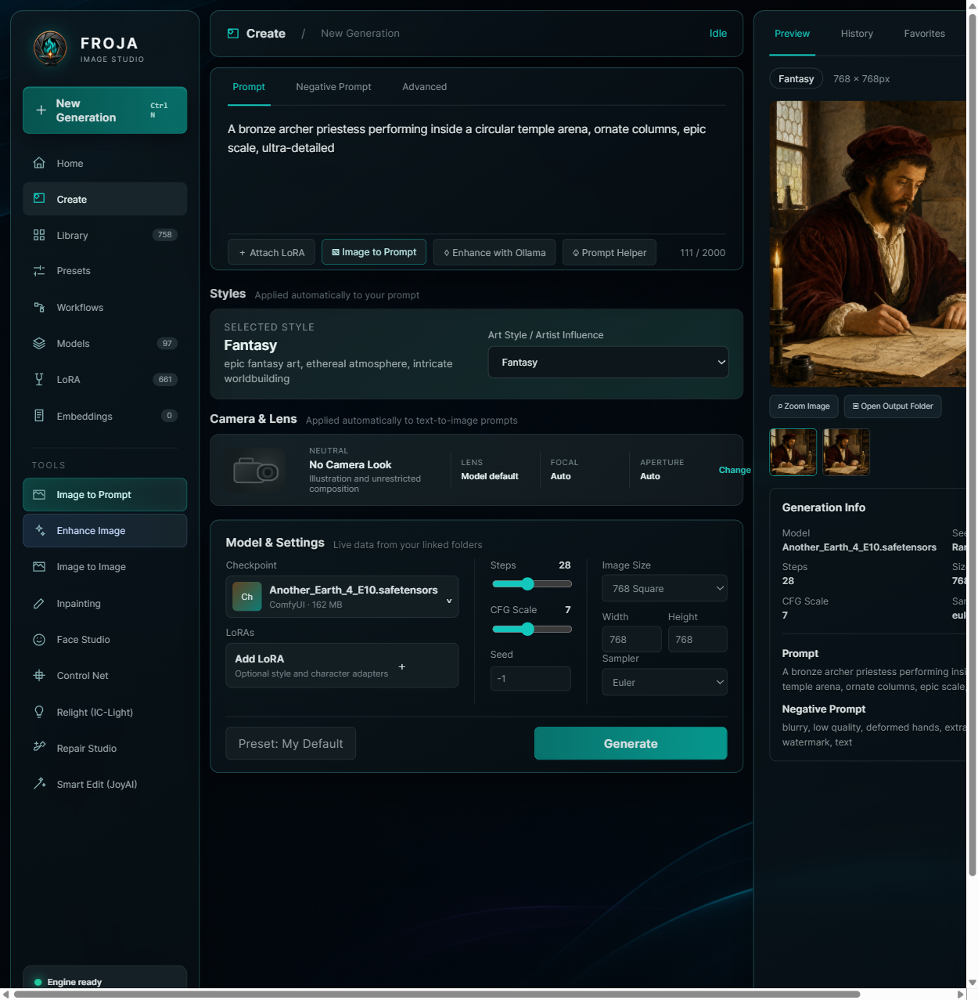

# Froja Image Studio

<p align="center">
  
</p>

<p align="center">
  A modern, local-first image studio built around ComfyUI, your own models, and an approachable creative workflow.
</p>

<p align="center">
  <strong>Text to image · Image to prompt · LoRA library · Enhancement · Relighting · Repair · Face tools · Ollama assistance</strong>
</p>

> **Project status:** active work in progress. The main generation workflow is usable today; advanced editing workflows are experimental and depend on the ComfyUI nodes and models installed on the user's machine.



## Why Froja?

Froja brings common generative-image tasks into one clean interface while leaving model ownership with the user. It indexes existing model folders instead of duplicating multi-gigabyte files. Your prompts, images, models, and Ollama conversations remain on your computer.

### Highlights

- Local text-to-image generation through ComfyUI.
- Checkpoint, LoRA, VAE, and embedding discovery from configurable folders.
- Model and LoRA preview images plus trigger-word metadata.
- Prompt and negative-prompt editing.
- Automatic `<lora:name:strength>` recognition.
- Z-Image Turbo and Krea-2 Turbo workflow builders.
- Image-to-prompt recognition with an Ollama vision model.
- Prompt creation and enhancement with Ollama.
- Image enhancement with sharpen, denoise, dust reduction, lighting, colour, and upscale controls.
- Image-to-image, inpainting, and ControlNet entry points.
- IC-Light relighting controls.
- Face replacement and face restoration tools.
- Repair tools for faces, hands, bodies, and selected regions.
- JoyAI natural-language image editing integration.
- Local History and Favorites with generation metadata and zoom.
- Built-in bronze, teal, and cosmic themes, custom backgrounds, font scaling, and multiple interface languages.
- Coordinated VRAM handoff between isolated ComfyUI engines.

## Requirements

- Windows 10/11 or a modern Linux distribution.
- Python 3.10 or newer.
- Node.js 22 or newer.
- A working ComfyUI installation.
- NVIDIA GPU recommended. Advanced workflows have higher VRAM requirements.
- Optional: [Ollama](https://ollama.com/) for prompt tools and image recognition.
- Optional: a separate JoyAI-compatible ComfyUI installation for Smart Edit.

Froja does **not** download checkpoints or LoRAs automatically and does not include copyrighted model weights.

## Quick start — Windows

1. Download the Windows ZIP from the GitHub Releases page and extract it.
2. Double-click `SETUP_WINDOWS.bat`.
3. Open `config/config.local.json` and enter the path to your ComfyUI installation.
4. Double-click `START_FROJA.bat`.
5. Open `http://127.0.0.1:3000` if the browser does not open automatically.

Developer installation:

```powershell
git clone https://github.com/debattistacliff-commits/Froja-Image-Studio.git
cd Froja-Image-Studio
.\SETUP_WINDOWS.bat
```

## Quick start — Linux

```bash
git clone https://github.com/debattistacliff-commits/Froja-Image-Studio.git
cd Froja-Image-Studio
chmod +x setup-linux.sh start-froja.sh
./setup-linux.sh
```

Edit `config/config.local.json`, then launch:

```bash
./start-froja.sh
```

## Connect Froja to ComfyUI

Copy `config/config.example.json` to `config/config.local.json`. The local file is ignored by Git and is never uploaded.

```json
{
  "comfy_root": "C:/AI/ComfyUI",
  "comfy_url": "http://127.0.0.1:9000",
  "model_roots": {
    "checkpoints": ["C:/AI/ComfyUI/models/checkpoints"],
    "loras": ["C:/AI/ComfyUI/models/loras"],
    "vae": ["C:/AI/ComfyUI/models/vae"],
    "embeddings": ["C:/AI/ComfyUI/models/embeddings"]
  },
  "diffusion_models_root": "C:/AI/ComfyUI/models/diffusion_models"
}
```

Use forward slashes in JSON paths on Windows. Froja can start ComfyUI from its `.venv`, or connect to an engine already running at `comfy_url`.

If models live outside ComfyUI, add those folders to `model_roots` and make them visible to ComfyUI through its `extra_model_paths.yaml`. Set `extra_model_paths_config` to that YAML file.

## Where models go

| Asset | Standard ComfyUI folder |
|---|---|
| Checkpoints | `ComfyUI/models/checkpoints/` |
| LoRAs | `ComfyUI/models/loras/` |
| VAEs | `ComfyUI/models/vae/` |
| Embeddings | `ComfyUI/models/embeddings/` |
| Diffusion models / UNets | `ComfyUI/models/diffusion_models/` |
| Text encoders | `ComfyUI/models/text_encoders/` |
| ControlNet | `ComfyUI/models/controlnet/` |

Preview images can sit beside a model using names such as `model.preview.png`, `model.png`, or `model.jpg`. LoRA metadata may be read from neighboring `.json` or `.txt` files.

## Connect Ollama

Install Ollama, then pull the default writing and vision models:

```bash
ollama pull qwen3.5:4b
ollama pull qwen3-vl:4b
```

Ollama normally listens at `http://127.0.0.1:11434`. Change `ollama_url` in `config.local.json` if yours uses another address.

- **Enhance with Ollama** rewrites a short idea as a production prompt.
- **Image to Prompt** analyzes an uploaded image with the vision model and polishes the result with the writing model.

## Z-Image Turbo and Krea-2

Froja includes workflow builders for these architectures, but users must obtain compatible weights legally and install their required text encoders, VAEs, and ComfyUI nodes. Filenames and node availability vary between releases; see [docs/MODELS.md](docs/MODELS.md).

## Privacy and model safety

- Froja binds to `127.0.0.1` by default.
- Model files remain in user-selected folders.
- History and Favorites are stored locally in the browser profile.
- Generated images remain in the configured ComfyUI output directory.
- Public packages contain no checkpoints, LoRAs, embeddings, VAEs, user prompts, histories, or generated output.

## Development

```bash
npm install
python -m pip install -r requirements.txt
npm run dev
```

Release checks:

```bash
npm run lint
npx tsc --noEmit
npm test
```

## Collaboration

Ideas, testing, documentation, translations, UI improvements, workflow adapters, and bug fixes are welcome. Please read [CONTRIBUTING.md](CONTRIBUTING.md) and the [roadmap](ROADMAP.md).

- Use **Discussions** for ideas and design suggestions.
- Use **Issues** for reproducible bugs and feature proposals.
- Use **Pull Requests** for reviewed code contributions.
- Never upload proprietary model weights, personal images, tokens, or machine-specific configuration.

## Acknowledgements

Froja integrates with independent open-source projects including ComfyUI and Ollama. Their names and trademarks belong to their respective owners. Froja is not affiliated with Civitai, Stability AI, ComfyUI, Ollama, Krea, or the creators of third-party models and nodes.

## License

Froja Image Studio source code is released under the [MIT License](LICENSE). Model weights, preview images, third-party nodes, and generated content may have separate licenses and are not covered by Froja's license.
